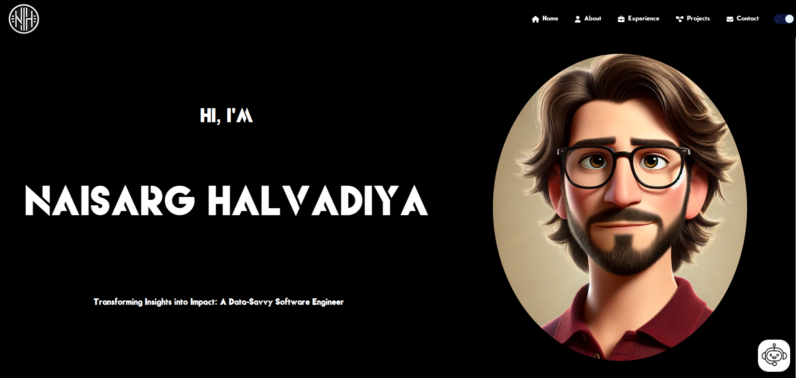
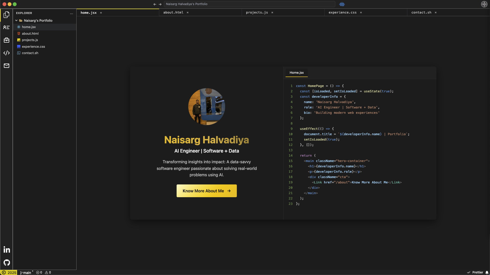
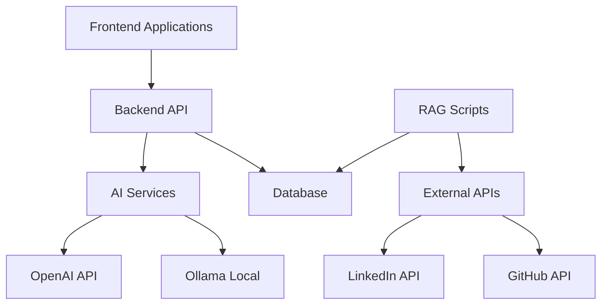

# Portfolio Repository

A comprehensive portfolio ecosystem showcasing multiple frontend implementations, intelligent backend services, and advanced data processing capabilities for creating personalized AI-powered experiences.

## Motivation

This portfolio ecosystem evolved from a simple desire to experiment with different technologies and create something truly unique:

**The Journey:**
1. **Simple React Portfolio** - Started as my first attempt to explore Three.js and create a clean, minimalist portfolio
2. **VS Code Themed Portfolio** - As a software developer, I have a weird inclination towards VS Code, so I decided to build a portfolio that looks and feels like my favorite IDE
3. **AI-Powered Backend** - With the rise of GenAI, I realized that just having a static website is very banal. Why not make it more immersive? Hence, I created an AI buddy that knows everything about my professional life
4. **RAG Data Processing** - To make the AI truly intelligent, I built comprehensive data extraction tools that process my LinkedIn, GitHub, and resume data to create a personalized knowledge base

The result is a portfolio that not only showcases technical skills but provides visitors with an interactive, intelligent experience that can answer questions about my background, projects, and expertise in real-time.

## Repository Structure

```
Portfolio/
├── Frontend/
│   ├── simple-react/          # Minimalist React portfolio
│   └── vscode-themed/         # VS Code themed portfolio
├── Backend/                   # Flask API for portfolio chatbot
└── Scripts/                   # RAG data extraction and processing tools
```

## Components Overview

### Frontend Applications

#### Simple React Portfolio (`Frontend/simple-react/`)

A clean, minimalist portfolio website built with React.js that focuses on content and user experience.

**Key Features:**
- Responsive design with dark/light theme toggle
- Smooth animations and transitions between sections
- Customizable content through JSON configuration
- Modern UI with accessibility compliance
- Fast loading times with optimized assets
- SEO-friendly structure

**Technologies Used:**
- React 18+ with functional components and hooks
- CSS3 with custom animations
- Context API for theme management
- Responsive design principles

**Screenshots:**


**Getting Started:**
```bash
cd Frontend/simple-react
npm install
npm start
# Open http://localhost:3000
```

**Configuration:**
Edit `src/data/data.json` to customize:
- Personal information and bio
- Skills and technologies
- Project details and links
- Experience and education
- Contact information

#### VS Code Themed Portfolio (`Frontend/vscode-themed/`)

A unique portfolio website that mimics the VS Code interface, providing an immersive developer experience.

**Key Features:**
- VS Code-inspired UI with file explorer, terminal, and editor panels
- Interactive file navigation system
- Real-time chatbot integration
- Professional developer-focused design
- Component-based architecture with Tailwind CSS
- Advanced theming and customization options

**Technologies Used:**
- React with modern hooks and context
- Tailwind CSS for styling
- Custom component library
- Real-time API integration
- Advanced state management

**Screenshots:**


**Getting Started:**
```bash
cd Frontend/vscode-themed
npm install
npm start
# Open http://localhost:3000
```

**Configuration:**
Update `src/config/portfolioConfig.js` for:
- File structure and navigation
- Theme colors and styling
- API endpoints and services
- Component behavior and interactions

### Backend Service

#### Portfolio Chatbot API (`Backend/`)

A robust Flask-based REST API that powers intelligent chatbot functionality across all portfolio sites.

**Key Features:**
- Natural language processing for user queries
- Integration with multiple AI services (OpenAI, Ollama, etc.)
- RESTful API design with comprehensive error handling
- CORS support for cross-origin requests
- Rate limiting and security measures
- Scalable architecture for production deployment
- Comprehensive logging and monitoring

**API Endpoints:**
- `POST /chat` - Main chat endpoint for user interactions
- `GET /health` - Health check endpoint
- `POST /feedback` - User feedback collection
- `GET /analytics` - Usage analytics (if implemented)

**Technologies Used:**
- Python 3.8+ with Flask framework
- RESTful API design principles
- JSON Web Tokens for authentication
- SQLite/PostgreSQL for data persistence
- Docker support for containerization

**Getting Started:**
```bash
cd Backend
pip install -r requirements.txt
python app.py
# API available at http://localhost:5000
```

**Environment Variables:**
```bash
# Required environment variables
OPENAI_API_KEY=your_openai_api_key
OLLAMA_BASE_URL=http://localhost:11434
DATABASE_URL=sqlite:///portfolio.db
SECRET_KEY=your_secret_key
```

**Deployment:**
The API can be deployed to:
- Vercel (serverless functions)
- Heroku (container deployment)
- AWS/GCP/Azure (cloud platforms)
- Docker containers (any platform)

### Data Processing Scripts

#### RAG Data Extraction (`Scripts/`)

Comprehensive tools for creating a Retrieval-Augmented Generation (RAG) system that processes personal data to create an intelligent knowledge base.

**Key Features:**
- LinkedIn profile data extraction and processing
- GitHub repository scraping and analysis
- Resume parsing and skill extraction
- MongoDB integration for scalable data storage
- Automated data processing pipeline
- Docker containerization for easy deployment
- Data validation and cleaning utilities

**Processing Pipeline:**
1. **Data Collection**: Scrape LinkedIn, GitHub, and resume data
2. **Data Processing**: Clean, validate, and structure collected data
3. **Vectorization**: Convert text data to embeddings for semantic search
4. **Storage**: Store processed data in MongoDB with proper indexing
5. **Retrieval**: Implement semantic search for relevant information retrieval

**Technologies Used:**
- Python 3.8+ with async/await support
- BeautifulSoup and Selenium for web scraping
- MongoDB for document storage
- OpenAI embeddings for vectorization
- Docker for containerization
- Pandas for data manipulation

**Getting Started:**
```bash
cd Scripts
pip install -r requirements.txt
python main.py
```

**Configuration:**
Set up the following in `config.py`:
```python
# MongoDB connection
MONGODB_URI = "mongodb://localhost:27017"
DATABASE_NAME = "portfolio_rag"

# API keys
LINKEDIN_API_KEY = "your_linkedin_api_key"
GITHUB_TOKEN = "your_github_token"
OPENAI_API_KEY = "your_openai_api_key"

# Processing settings
BATCH_SIZE = 100
MAX_RETRIES = 3
```

**Data Sources:**
- **LinkedIn**: Professional experience, education, skills, connections
- **GitHub**: Repository analysis, commit history, language usage
- **Resume**: Skills, experience, education, certifications
- **Custom Data**: Additional personal information and preferences

## Architecture Overview




## Development Workflow

### Local Development Setup

1. **Clone the repository:**
```bash
git clone https://github.com/your-username/portfolio.git
cd portfolio
```

2. **Set up Frontend Applications:**
```bash
# Simple React Portfolio
cd Frontend/simple-react
npm install
npm start

# VS Code Themed Portfolio (in another terminal)
cd Frontend/vscode-themed
npm install
npm start
```

3. **Set up Backend API:**
```bash
cd Backend
python -m venv venv
source venv/bin/activate  # On Windows: venv\Scripts\activate
pip install -r requirements.txt
python app.py
```

4. **Set up RAG Processing:**
```bash
cd Scripts
python -m venv venv
source venv/bin/activate
pip install -r requirements.txt
python main.py
```

### Environment Configuration

Create `.env` files in each component directory:

**Frontend/.env:**
```bash
REACT_APP_API_URL=http://localhost:5000
REACT_APP_ENVIRONMENT=development
```

**Backend/.env:**
```bash
FLASK_ENV=development
OPENAI_API_KEY=your_key_here
DATABASE_URL=sqlite:///portfolio.db
```

**Scripts/.env:**
```bash
MONGODB_URI=mongodb://localhost:27017
LINKEDIN_API_KEY=your_key_here
GITHUB_TOKEN=your_token_here
```

## Deployment Strategies

### Frontend Deployment

**Netlify (Recommended):**
```bash
# Build the application
npm run build

# Deploy to Netlify
netlify deploy --prod --dir=build
```

**Vercel:**
```bash
# Install Vercel CLI
npm i -g vercel

# Deploy
vercel --prod
```

### Backend Deployment

**Vercel (Serverless):**
```bash
# Install Vercel CLI
npm i -g vercel

# Deploy
vercel --prod
```

**Docker:**
```bash
# Build image
docker build -t portfolio-api .

# Run container
docker run -p 5000:5000 portfolio-api
```

### RAG Scripts Deployment

**Docker Compose:**
```yaml
version: '3.8'
services:
  rag-processor:
    build: .
    environment:
      - MONGODB_URI=mongodb://mongo:27017
    depends_on:
      - mongo
  
  mongo:
    image: mongo:latest
    ports:
      - "27017:27017"
```

## Performance Optimization

### Frontend Optimizations
- Code splitting and lazy loading
- Image optimization and compression
- Bundle size analysis and optimization
- Service worker implementation for caching
- CDN integration for static assets

### Backend Optimizations
- Database query optimization
- Caching strategies (Redis)
- Rate limiting and request throttling
- Connection pooling
- Async processing for heavy operations

### RAG System Optimizations
- Batch processing for large datasets
- Vector indexing for fast retrieval
- Data compression and storage optimization
- Parallel processing for multiple data sources
- Incremental updates for real-time data

## Security Considerations

### Frontend Security
- Content Security Policy (CSP) implementation
- XSS protection and input sanitization
- HTTPS enforcement
- Secure API communication

### Backend Security
- API authentication and authorization
- Input validation and sanitization
- Rate limiting and DDoS protection
- Secure environment variable management
- Database security and access control

### Data Processing Security
- Secure API key management
- Data encryption at rest and in transit
- Access logging and monitoring
- Privacy compliance (GDPR, CCPA)

## Monitoring and Analytics

### Application Monitoring
- Error tracking and logging
- Performance monitoring
- User analytics and behavior tracking
- API usage metrics
- System health monitoring

### Recommended Tools
- **Error Tracking**: Sentry, Rollbar
- **Analytics**: Google Analytics, Mixpanel
- **Performance**: Lighthouse, WebPageTest
- **Monitoring**: DataDog, New Relic
- **Logging**: Winston, LogRocket

## Contributing

We welcome contributions to improve this portfolio ecosystem. Here's how you can help:

### Development Process
1. Fork the repository
2. Create a feature branch (`git checkout -b feature/amazing-feature`)
3. Make your changes with proper testing
4. Update documentation as needed
5. Commit your changes (`git commit -m 'Add amazing feature'`)
6. Push to the branch (`git push origin feature/amazing-feature`)
7. Open a Pull Request

### Code Standards
- Follow existing code style and conventions
- Write comprehensive tests for new features
- Update documentation for any API changes
- Ensure all components work together seamlessly
- Follow security best practices

### Areas for Contribution
- New frontend themes and designs
- Backend API enhancements
- RAG system improvements
- Documentation and examples
- Performance optimizations
- Security enhancements

## License

This project is licensed under the MIT License - see the [LICENSE](LICENSE) file for details.

## Contact and Support

For questions, collaboration opportunities, or support:

- **Email**: [Your Email]
- **LinkedIn**: [Your LinkedIn Profile]
- **GitHub**: [Your GitHub Profile]
- **Portfolio**: [Your Portfolio URL]

## Acknowledgments

- React community for excellent documentation and ecosystem
- VS Code team for design inspiration and developer experience
- OpenAI for powerful AI capabilities
- MongoDB team for flexible document storage
- All open source contributors whose libraries make this project possible

---

*This portfolio repository demonstrates modern full-stack development practices, AI integration, and scalable architecture design. Each component can be used independently or together to create a comprehensive portfolio solution.*